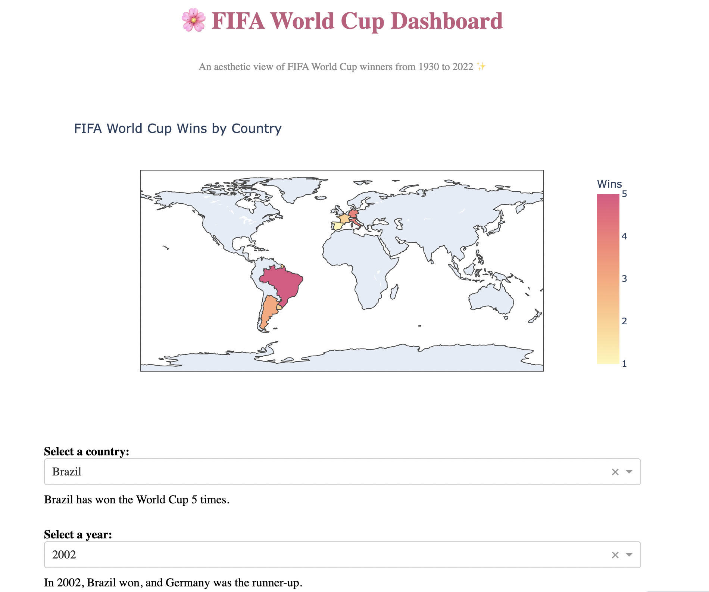

# FIFA World Cup Dashboard 🌍⚽



An interactive dashboard built with Dash and Plotly to visualize FIFA World Cup results from 1930 to 2022.

## Overview

This project explores historical FIFA World Cup data through interactive visualizations and user-driven filtering. The dashboard allows users to analyze World Cup winners, runner-up teams, and country-level tournament success through an intuitive web interface.

The goal of the project was to demonstrate data visualization, dashboard development, and interactive analytics using Python.

## Features

* Interactive choropleth map displaying World Cup victories by country
* Country-level analysis of tournament wins
* Year-based filtering to view World Cup winners and runners-up
* Dynamic dashboard components powered by Dash callbacks
* Responsive and user-friendly interface

## Technologies

* Python
* Pandas
* Plotly
* Dash

## Dataset

Source: FIFA World Cup Finals historical data (1930–2022)

The dataset contains information about tournament years, winning nations, and runner-up nations, which are aggregated and visualized throughout the dashboard.

## Running the Dashboard

```bash
pip install -r requirements.txt
python fifa_dashboard.py
```

Then open:

```text
http://0.0.0.0:8050/
```

in your browser.

## Skills Demonstrated

* Data cleaning and transformation
* Interactive dashboard development
* Data visualization
* Geospatial visualization using choropleth maps
* User-driven analytics with dynamic filtering

