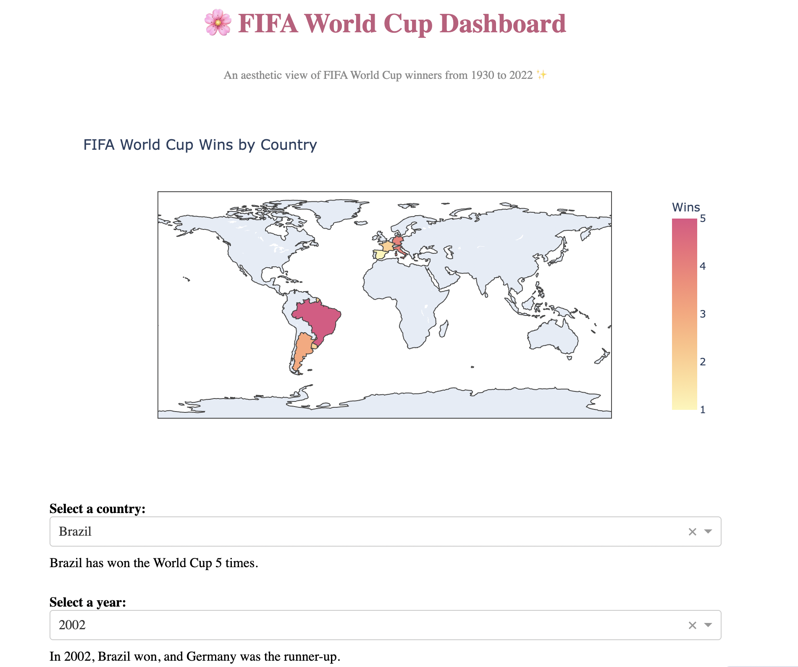

# FIFA World Cup Dashboard 🌍⚽



An interactive and aesthetic dashboard built using **Dash**, **Plotly**, and **Pandas** to visualize FIFA World Cup winners and runner-ups from 1930 to 2022.

---

## 💻 Features
- 📊 **Choropleth Map** of World Cup wins by country
- 🏆 View how many times each country has won
- 📅 Select a year to see that year’s winner and runner-up
- ✨ Styled with pastel theme and clean layout

---

## 📁 Dataset
Source: [Wikipedia – FIFA World Cup finals](https://en.wikipedia.org/wiki/List_of_FIFA_World_Cup_finals)  
File: `fifa_world_cup_finals.csv`

---

## 🚀 How to Run

### 1. Install requirements
```bash
pip install -r requirements.txt
```

### 2. Run the app
```bash
python fifa_dashboard.py
```

### 3. Open in browser
Go to:  
[http://0.0.0.0:8050/](http://0.0.0.0:8050/)

---

## 🌸 Made with love using Dash + Plotly
